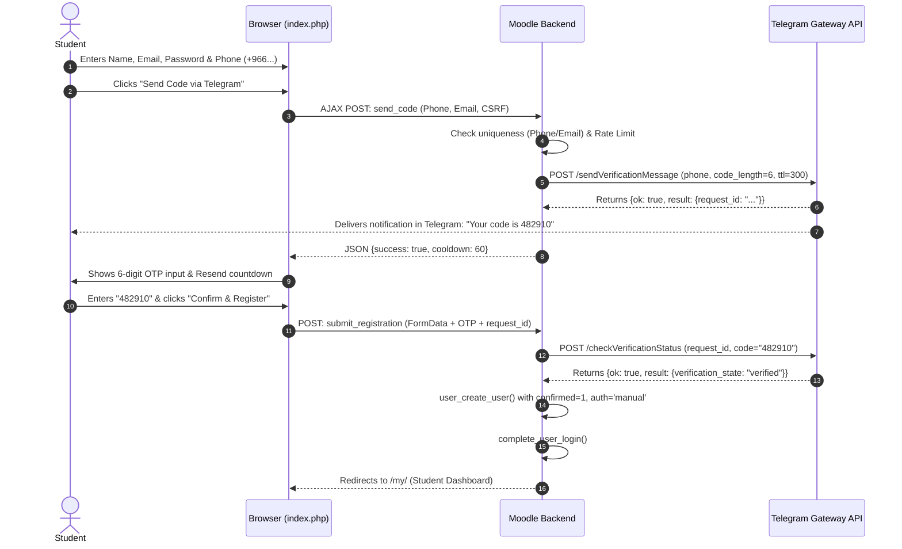

# Implementation Plan: Standalone Moodle Plugin `local_telegramotp`

A dedicated, lightweight Moodle `local` plugin that provides **phone-first new user registration** with **synchronous Telegram Gateway OTP verification**. Accounts are only created upon successful verification (zero grace period, no complex locking mechanisms, and no webhooks).

---

## 1. Architectural Overview & Design Goals

Unlike traditional legacy verification plugins (which supported WhatsApp inbound webhooks, 30-day grace periods, reminders, and course suspensions), `local_telegramotp` is designed to be **focused, modern, and lightweight**:

1. **Synchronous Verification (No Grace Period)**:
   - Users are verified *before* the account is inserted into Moodle's `user` table.
   - No pending states, no 30-day countdowns, no banners, and no enrolment suspension logic.
2. **Outbound API Integration**:
   - Uses the official [Telegram Gateway API](https://core.telegram.org/gateway) (`https://gatewayapi.telegram.org`).
   - Zero webhook setup: All interactions are direct HTTPS REST calls from Moodle to Telegram.
3. **Cost & Reliability**:
   - \$0.01 per delivered code with automatic refunds from Telegram for undelivered messages.
   - Immediate feedback if a phone number is not registered on Telegram.
4. **Clean Moodle Standards**:
   - Compatible with Moodle 4.x and Moodle 5.x.
   - Strict CSRF protection (`sesskey`), rate limiting (IP & Phone), Arabic digit normalization (`٠-٩`), and local asset bundling (no CDN).

---

## 2. Proposed Plugin Structure

```
local_telegramotp/
├── classes/
│   ├── client.php             # Telegram Gateway HTTP REST client (cURL)
│   ├── manager.php            # E.164 phone normalization & rate limiting
│   └── form/
│       └── register_form.php  # Registration form with phone picker and OTP field
├── db/
│   ├── access.php             # Plugin capabilities
│   ├── install.xml            # Lightweight OTP request & rate-limit log
│   └── upgrade.php            # Schema upgrade handlers
├── lang/
│   ├── en/local_telegramotp.php # English language strings
│   └── ar/local_telegramotp.php # Arabic language strings
├── vendor/
│   └── intl-tel-input/        # Bundled phone picker library (no external CDN)
├── ajax.php                   # Secure AJAX endpoint for requesting & verifying OTP
├── index.php                  # Public registration and OTP entry page
├── settings.php               # Site administration settings
├── styles.css                 # Modern responsive styling for registration & OTP cards
├── version.php                # Plugin metadata ($plugin->component = 'local_telegramotp')
└── README.md                  # Installation, configuration, and testing guide
```

---

## 3. Database Schema (`db/install.xml`)

Only a single lightweight table is required to manage security, rate-limiting, and verification state:

### Table: `local_telegramotp_requests`
| Field | Type | Attributes | Description |
| :--- | :--- | :--- | :--- |
| `id` | INT(10) | NOT NULL, AUTO_INCREMENT, PRIMARY | Record ID |
| `phone` | CHAR(20) | NOT NULL | Normalized E.164 phone number |
| `email` | CHAR(255) | NOT NULL | Pre-validated email address |
| `request_id` | CHAR(100) | NOT NULL | Telegram Gateway `request_id` |
| `ip_address` | CHAR(45) | NOT NULL | Client IP for abuse prevention |
| `status` | CHAR(20) | NOT NULL, DEFAULT 'pending' | Status: `pending`, `verified`, `expired`, `failed` |
| `attempts` | INT(4) | NOT NULL, DEFAULT 0 | Failed verification attempts |
| `timecreated` | INT(10) | NOT NULL | Request timestamp |
| `timemodified` | INT(10) | NOT NULL | Last update timestamp |

*Indexes: `phone_ix` (phone), `ip_ix` (ip_address, timecreated), `reqid_uix` (unique request_id).*

---

## 4. User Journey & Registration Flow



---

## 5. Security & Abuse Prevention

1. **Rate Limiting**:
   - Maximum **3 OTP requests per phone number** within 15 minutes.
   - Maximum **5 OTP requests per IP address** per hour.
   - Cooldown timer of **60 seconds** before "Resend Code" becomes active.
2. **Brute Force Protection**:
   - Maximum **5 incorrect attempts** per `request_id`. Exceeding this invalidates the request.
3. **Data Integrity & Privacy**:
   - Phone numbers sanitized and normalized to E.164 (stripping leading zeros, localized digits, and symbols).
   - Honeypot hidden input field to silently reject automated spam bots.
   - Form inputs secured with Moodle session keys (`sesskey`).

---

## 6. Admin Configuration Settings (`settings.php`)

Located in: **Site administration → Plugins → Local plugins → Telegram OTP Registration**

* **Enabled**: Enable / disable Telegram registration.
* **Telegram Gateway API Token**: Bearer token from `gateway.telegram.org`.
* **Verification Code Length**: Choice of 4, 6 (recommended), or 8 digits.
* **Code TTL (Time-To-Live)**: Validity duration (default: 300 seconds / 5 minutes).
* **Resend Cooldown**: Seconds before a resend is allowed (default: 60 seconds).
* **Max Attempts per IP / Hour**: Configurable limit (default: 5).
* **Default Language / Country**: Default dialing code in the phone picker.

---

## 7. Open Questions & Review Items

> [!IMPORTANT]
> **Password Handling**: Does your institution prefer students to set their own password during registration, or would you like to allow **passwordless Telegram OTP login** in the future as well?

> [!NOTE]
> **Fallback Option**: What should happen if a student does not have Telegram?
> - **Option A (Strict Telegram)**: Display a message prompting them to install Telegram or verify with an existing account.
> - **Option B (Email Fallback)**: Provide a button to receive the verification link via email if Telegram delivery fails.

---

## 8. Verification & Testing Plan

### Automated / Unit Tests
* Phone normalizer test suite (handling Saudi `+9665...`, international formats, and Arabic numeral inputs).
* Mock HTTP client tests simulating Telegram Gateway success, invalid token, rate limits, and expired codes.

### Manual Verification
1. Test valid registration from mobile and desktop with live Telegram account.
2. Verify delivery of the 6-digit code inside the official Telegram app.
3. Test resend cooldown timer and invalid code attempts (lockout after 5 tries).
4. Verify account creation in Moodle: user created with confirmed status and logged in immediately.
