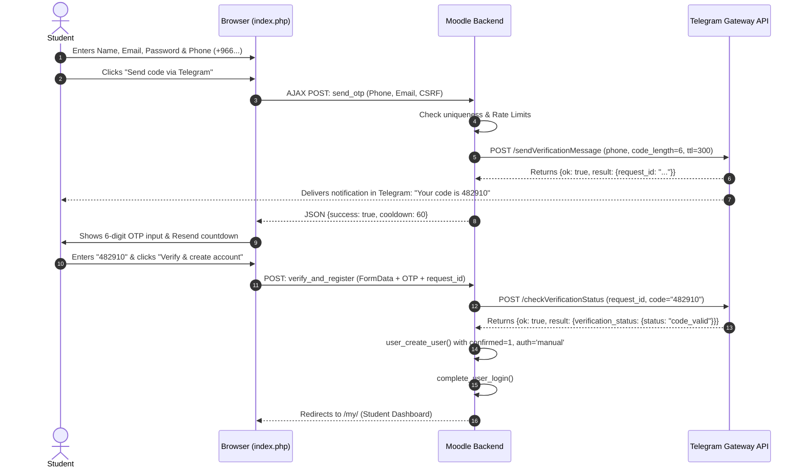

# Telegram OTP Registration for Moodle (`local_telegramotp`)

A dedicated, lightweight Moodle local plugin that provides **phone-first user registration** with **synchronous Telegram Gateway OTP verification**. Accounts are only created upon successful verification (zero grace period, no complex locking mechanisms, and no webhooks).

---

## 🚀 Key Features

* **Synchronous Verification**: Users are verified *before* their account is inserted into Moodle's `user` table. No pending states, no 30-day countdowns, no banners, and no enrolment suspension logic.
* **Direct Telegram Gateway API**: Uses the official [Telegram Gateway API](https://core.telegram.org/gateway) (`https://gatewayapi.telegram.org`) via simple outbound HTTPS REST calls. Zero webhook configuration required.
* **Cost Effective**: Pay-per-delivered-code with automatic refunds from Telegram for undelivered messages.
* **Multi-Layer Security & Rate Limiting**:
  * Maximum 3 OTP requests per phone number within 15 minutes.
  * Maximum 5 OTP requests per IP address per hour.
  * 60-second resend cooldown timer.
  * Maximum 5 incorrect OTP attempts before request lockout.
  * Anti-spam honeypot trap to eliminate bot submissions.
  * CSRF protection on all AJAX requests via Moodle session keys (`sesskey`).
* **Arabic & International Phone Normalization**: Automatically converts Eastern Arabic-Indic numerals (`٠-٩`) to ASCII and standardizes numbers into E.164 international format.
* **Modern Responsive Interface**: Beautiful multi-step card layout with individual OTP digit inputs, real-time feedback, and full RTL layout support.
* **Complete Moodle Compliance**: Implements the Moodle GDPR Privacy API, External Web Services API, dual English and Arabic localizations, and unit tests.

---

## 📋 Requirements

* Moodle 4.5+ or Moodle 5.x.
* PHP 8.1+ with cURL extension enabled.
* A Telegram Gateway account and API token from [gateway.telegram.org](https://gateway.telegram.org).

---

## ⚙️ Installation

1. Copy or clone the plugin directory into your Moodle installation under `local/telegramotp`:
   ```bash
   cd /path/to/moodle/local
   git clone https://github.com/Smartlearn-edu/moodle-local_telegramotp.git telegramotp
   ```
2. Navigate to **Site administration → Notifications** to complete the database installation.

---

## 🔧 Configuration

Go to **Site administration → Plugins → Local plugins → Telegram OTP registration**:

1. **Enable Telegram registration**: Turn on to activate the registration page.
2. **Development / test mode**: Turn on to simulate OTP verification without connecting to live Telegram or requiring a funded account.
3. **Test verification code**: The static code accepted when test mode is active (default: `123456`).
4. **Telegram Gateway API token**: Paste the Bearer token generated from your [Telegram Gateway dashboard](https://gateway.telegram.org) (only needed for live production).
5. **Verification code length**: Choose between 4, 6 (recommended), or 8 digits.
6. **Code validity (TTL)**: Number of seconds the code remains valid (default: 300 seconds).
7. **Resend cooldown**: Number of seconds before a user can request another code (default: 60 seconds).
8. **Max requests per IP / Phone**: Configure security rate limit thresholds.
9. **Default country**: Select the default dialing prefix (e.g., Saudi Arabia `+966`, Egypt `+20`, UAE `+971`).

---

## 📱 User Registration Flow



---

## 🧪 Testing

Run PHPUnit tests to verify business logic and normalization:
```bash
vendor/bin/phpunit --testsuite local_telegramotp_testsuite
```

---

## 📄 License

Licensed under the GNU General Public License v3 (or later). See [COPYING.txt](https://www.gnu.org/licenses/gpl-3.0.html) or LICENSE.
